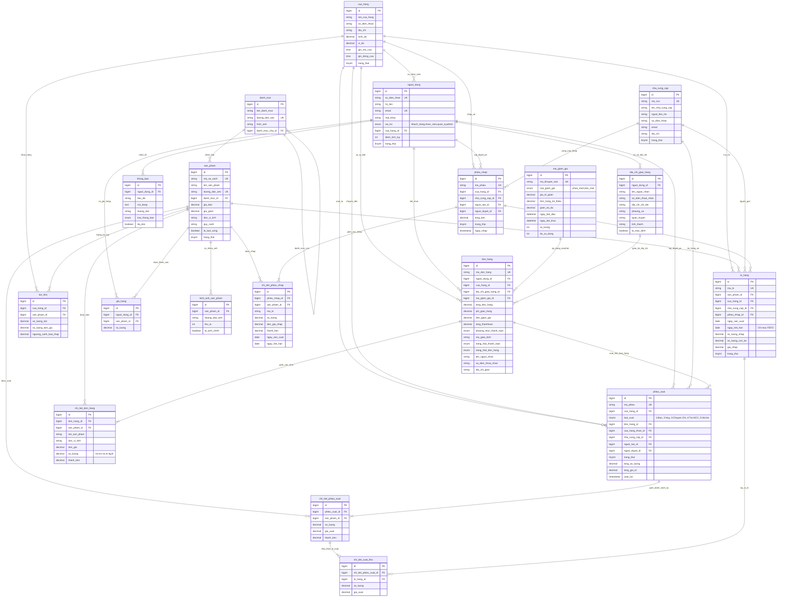
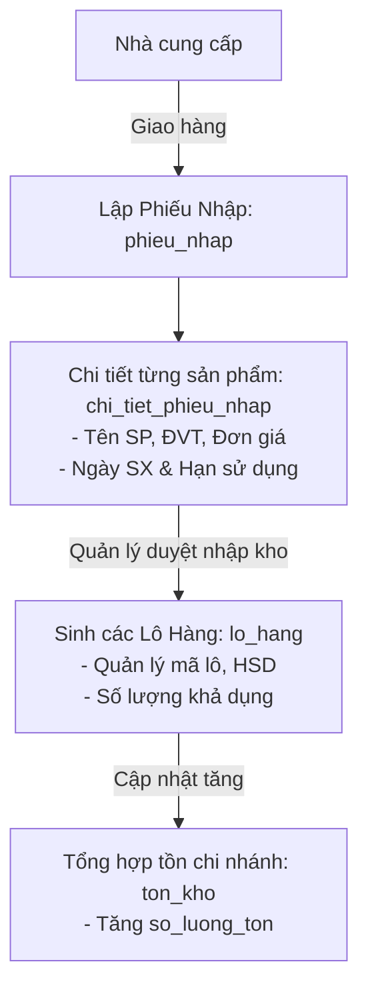
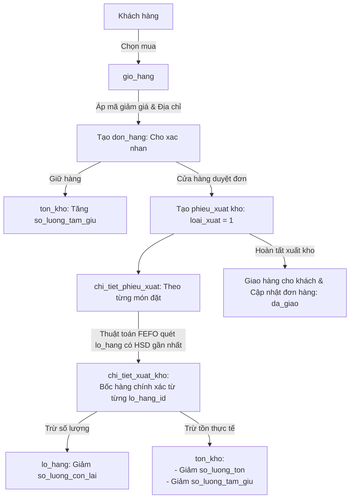

# SƠ ĐỒ THIẾT KẾ CƠ SỞ DỮ LIỆU - DỰ ÁN FRESH FOOD (THỰC PHẨM SẠCH)

Tài liệu này tổng hợp toàn bộ cấu trúc bảng, mối quan hệ và các luồng nghiệp vụ cốt lõi (Kho - FEFO - Bán hàng) được xây dựng từ hệ thống migration của dự án.

---

## 1. SƠ ĐỒ THỰC THỂ QUAN HỆ TỔNG THỂ (ERD)

---

## 2. CÁC LUỒNG NGHIỆP VỤ CỐT LÕI

### 2.1. Luồng Nhập Kho & Quản Lý Lô Hàng Hạn Dùng (FEFO)

### 2.2. Luồng Bán Hàng & Xuất Kho Tự Động FEFO

---

## 3. TÓM TẮT PHÂN CỤM DỮ LIỆU & RÀNG BUỘC TOÀN VẸN

| Phân cụm | Các bảng tham gia | Điểm nổi bật & Ràng buộc toàn vẹn |
| :--- | :--- | :--- |
| **Hệ thống & Chi nhánh** | `cua_hang`, `nguoi_dung`, `dia_chi_giao_hang`, `thong_bao` | Nhân viên/Quản lý gắn với `cua_hang_id`. Model `User` map trực tiếp vào bảng `nguoi_dung`. |
| **Catalog Sản phẩm** | `danh_muc`, `san_pham`, `hinh_anh_san_pham` | Hỗ trợ danh mục đa cấp, nhiều ảnh phụ, cờ `la_tuoi_song` và đơn vị tính linh hoạt. |
| **Nhập kho & Lô hàng** | `nha_cung_cap`, `phieu_nhap`, `chi_tiet_phieu_nhap`, `lo_hang`, `ton_kho` | Hỗ trợ lưu trữ hạn sử dụng chính xác đến từng ngày, phục vụ tự động hóa thuật toán xuất kho **FEFO** (First Expired, First Out). |
| **Bán hàng & Giỏ hàng** | `gio_hang`, `ma_giam_gia`, `don_hang`, `chi_tiet_don_hang` | Số lượng hỗ trợ số lẻ `decimal` (mua thịt cá rau củ theo kg). Khóa ngoại `don_hang` dùng `restrictOnDelete` để đảm bảo không bị mất doanh thu lịch sử. |
| **Xuất kho 2 tầng** | `phieu_xuat`, `chi_tiet_phieu_xuat`, `chi_tiet_xuat_kho` | Thiết kế 2 tầng: Dòng phiếu xuất gắn với Sản phẩm, chi tiết thực xuất gắn với từng Lô hàng cụ thể. |
